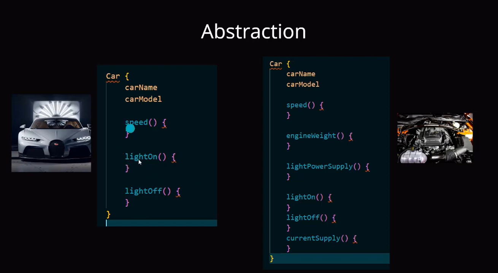

### Programming paradigm 
- Main Goal -
- Organize Code
- Easier Code 
- Clean + Understandable
- Easy to Explore
- Easy to Maintain
- Memory efficient
- Dry

###  Alternative methods to OOP include
- Functional Programming 
- Structured or modular Programming
- Imperative programming
- Declarative programming

### Why use OOP instead of others?
- Most using and widely use programming paradigm for large project

### How Object Oriented structured in programming
- Classes
- Objects
- Properties
- methods

- 

### Four Principles of OOP
- Abstraction
- Encapsulation
- Inheritance
- Polymorphism

### Abstraction
- Hide something for simplicity = অপ্রয়োজনীয় ডিটেইল লুকিয়ে রাখা।
- 
